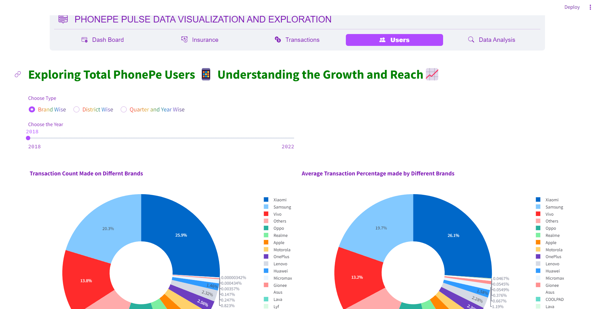

## PhonePe Pulse Data Visualization and Exploration Tool ##
### Introduction ###
The PhonePe Pulse GitHub repository contains a wealth of data encompassing various metrics and statistics. The aim of this project is to extract, process, and visualize this data in a user-friendly manner using Streamlit and Plotly.

### Libraries/Modules Required ###
-Plotly: For plotting and visualizing the data.
-Pandas: To create a DataFrame with the scraped data.
-Mysql: To store and retrieve the data.
-Streamlit: To create the graphical user interface.
-json: To load the JSON files

### Approach ###
Step 1: Cloning GitHub Repository
    Clone the GitHub repository using scripting to fetch the data from the PhonePe Pulse GitHub repository and store it in a suitable format such as JSON. Use the following command to clone the PhonePe GitHub repository into your local drive
 
Step 2: Importing the Libraries
    import os
    import json
    import pandas as pd
    import mysql.connector
    import streamlit as st
    from streamlit_option_menu import option_menu
    import plotly.express as px
    import requests
    import json
    import numpy as np
    import matplotlib.pyplot as plt
    import locale

Step 3: Data Transformation
    After cloning, the JSON files available in the folders are converted into a readable and understandable DataFrame format by using a for loop to iterate through each file. Finally, a DataFrame is created. To perform this step, we use the os, json, and pandas packages. The DataFrame is then converted into a CSV file and stored in the local drive.

Step 4: Dashboard Creation
    Use Plotly libraries in Python to create an interactive and visually appealing dashboard. Plotly's built-in Pie, Bar, Geo map functions are used to display the data on charts and maps. Streamlit is used to create a user-friendly interface with multiple dropdown options for users to select different facts and figures to display.

Step 5: Deployment
    Thoroughly test the dashboard and deploy it, making it accessible to users.

### Conclusion: ###
This tool enables users to explore and visualize the data from the PhonePe Pulse GitHub repository conveniently. With its user-friendly interface and interactive visualizations, users can gain insights into various metrics and statistics provided by PhonePe.

## Preview of Streamlit Application ##

